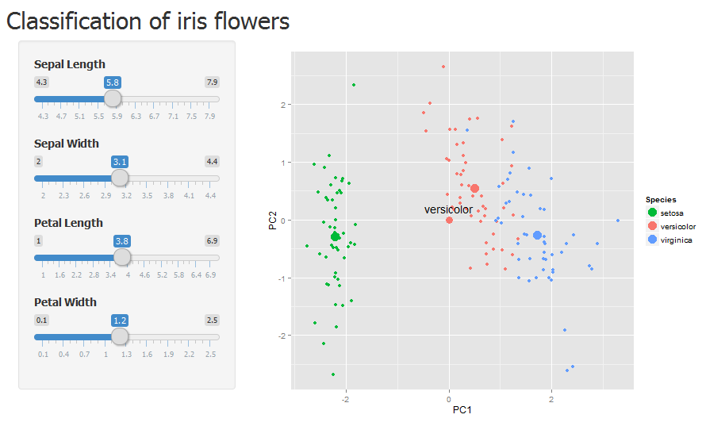

## Introduction

*	Algorithm is implemented to classify iris flowers based on size features. 
*	Visual implementation to facilitate its understanding to the user. 
*	Classification is performed with k-nearest neighbors and principal component analysis
*	Training set is from the Iris set.

--- .class #id1 

## Data

* The Iris flowers dataset is used to train the algorithm. 
* 4 numerical features: Sepal Length, Sepal Width, Petal Length, and Petal Width.
* 1 categorical variable: Species. 
* Species is the predicted variable.


```r
str(iris)
```

```
'data.frame':	150 obs. of  5 variables:
 $ Sepal.Length: num  5.1 4.9 4.7 4.6 5 5.4 4.6 5 4.4 4.9 ...
 $ Sepal.Width : num  3.5 3 3.2 3.1 3.6 3.9 3.4 3.4 2.9 3.1 ...
 $ Petal.Length: num  1.4 1.4 1.3 1.5 1.4 1.7 1.4 1.5 1.4 1.5 ...
 $ Petal.Width : num  0.2 0.2 0.2 0.2 0.2 0.4 0.3 0.2 0.2 0.1 ...
 $ Species     : Factor w/ 3 levels "setosa","versicolor",..: 1 1 1 1 1 1 1 1 1 1 ...
```

--- .class #id2

## Algorithm

* The data is transformed with <a href="http://en.wikipedia.org/wiki/Principal_component_analysis">principal component analysis</a> (PCA)
* Only keep the first two principal components.
* Take new measurements of Sepal.Width, Sepal.Length, Petal.Width and Petal.Length 
* Project them to the principal component (PC) space. 
* We obtain two measurements with this projection: the first and second principal components for the measurements, PC1 and PC2. 
* Plot PC1 and PC2. 
* Calculate how close they are to the center of the each clusters 
* Calculate the distance with the <a href='http://en.wikipedia.org/wiki/Mahalanobis_distance'>Mahalanobis distance.</a>
* A point is classified as the flower with the nearest center with the point.

--- .class #id3


## Application

* Change value of variable with the slider to move the new point.
* New point is projected onto the PC space of the flower data.
* Distance to the cluster centers is calculated.
* Color and name of the point change to color and name of the nearest flower cluster center.

<center></center>


